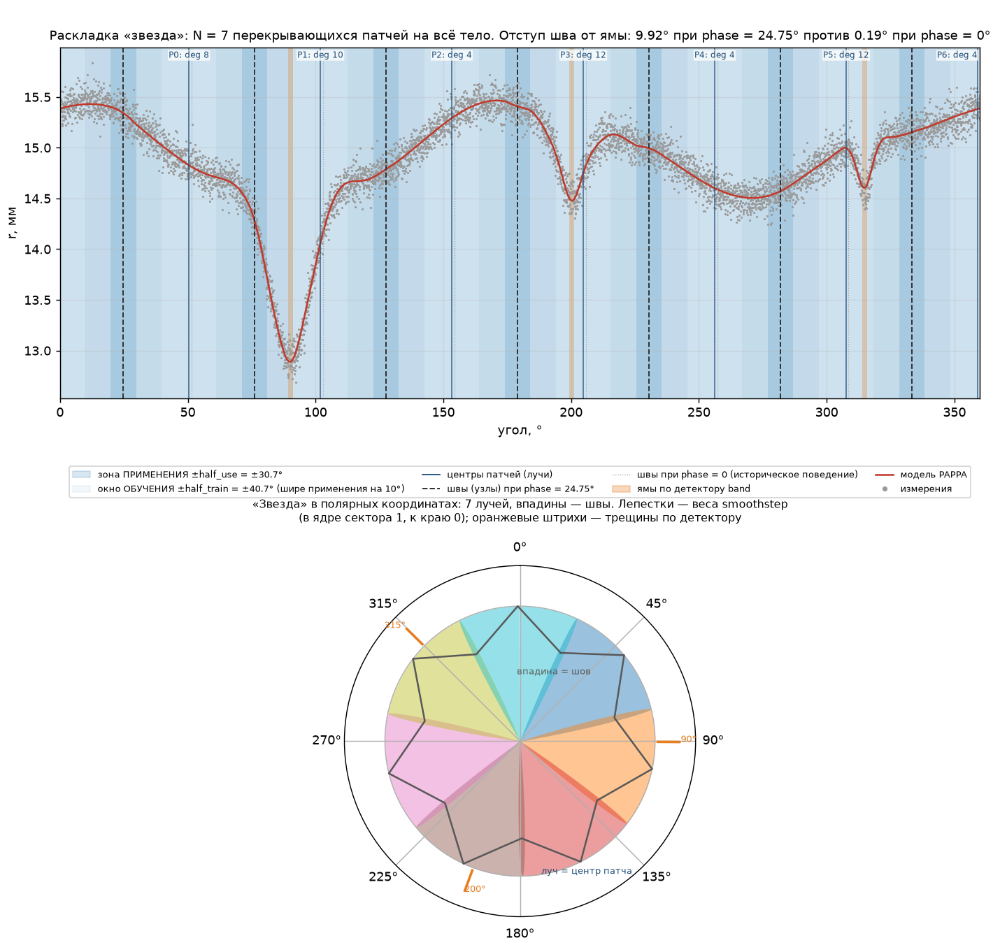
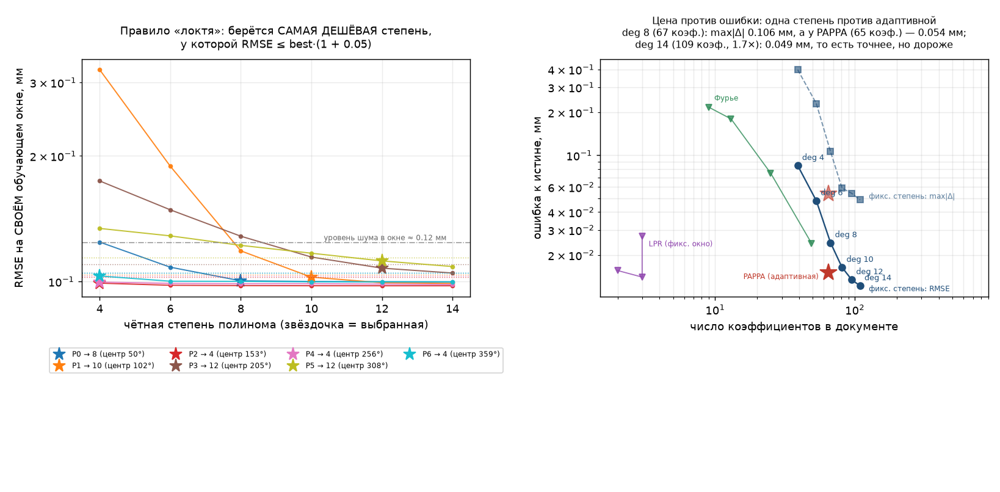
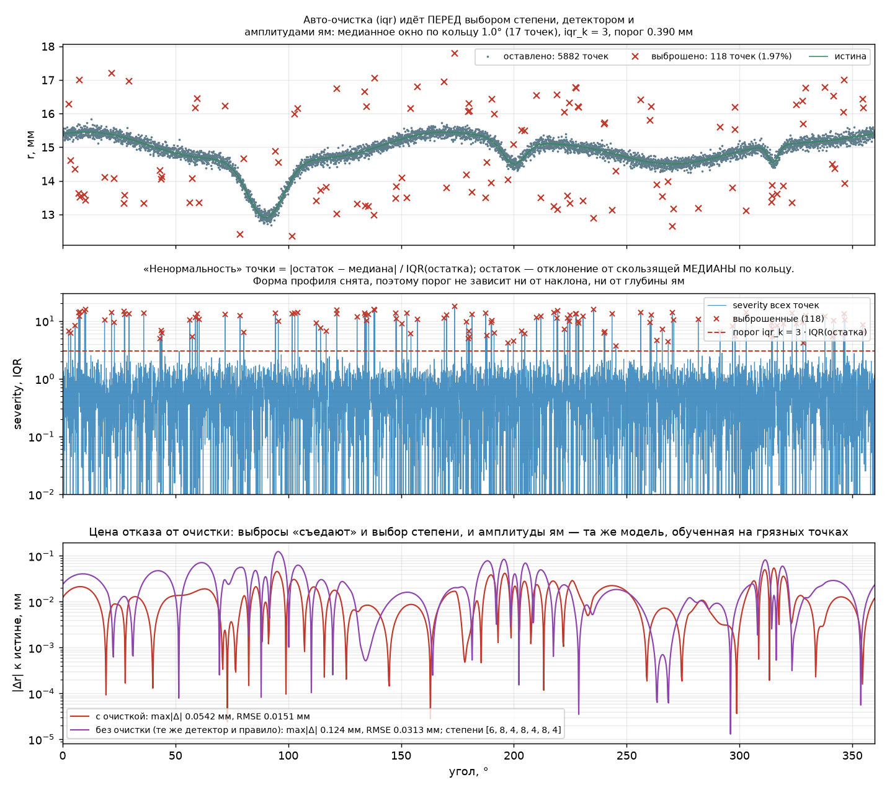
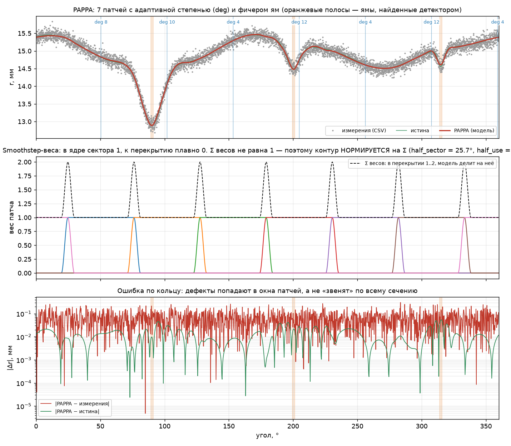
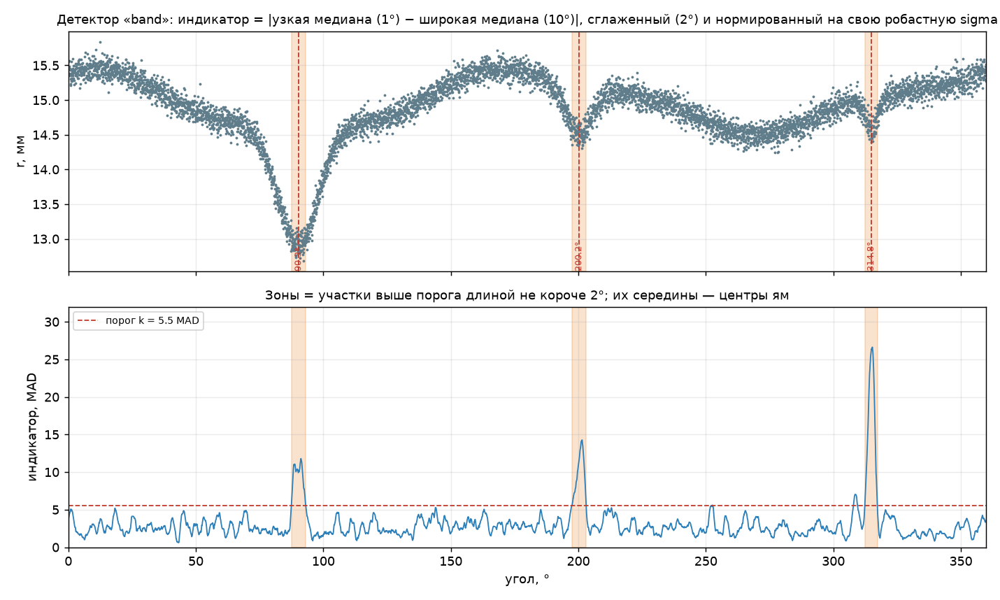
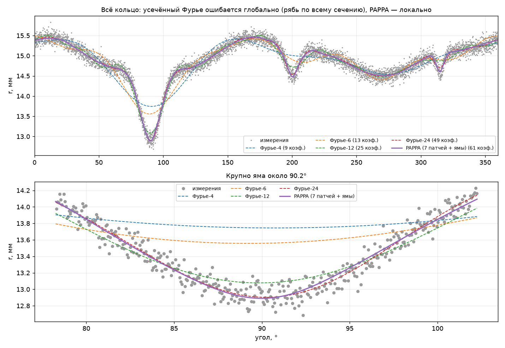
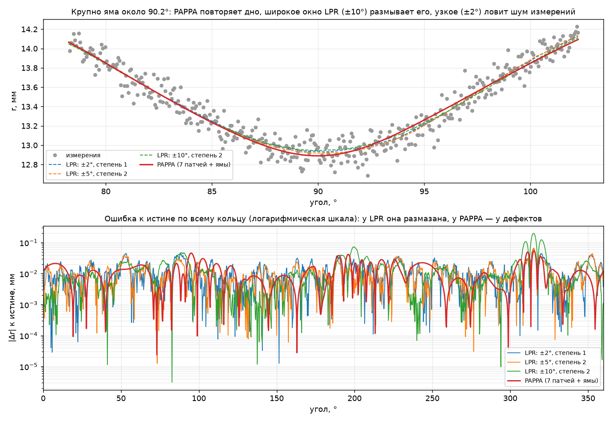

# pavlov-patches

**PAPPA — Piecewise Adaptive Poly-Patch Approximation** — *aka “Pavlov patches”.*

Adaptive **piecewise** polynomial approximation of closed (periodic) profiles:
`N` overlapping local patches on a **normalized local coordinate**
(`x / half_train ∈ [-1, 1]`), each patch an even-degree polynomial whose degree is
chosen by the **RMSE-elbow rule** on its own training window, blended by a
**normalized smoothstep partition of unity** (C¹, no derivative jumps at the
seams), with optional **tapered-Gaussian pit terms** for narrow deep defects. The
patches form one fixed **“star”** for the whole body — a single `N`, a single phase
shift of the seams — and are fitted to **cleaned** points (automatic IQR outlier
removal runs before the degree rule, the pit detector and the fit).

A model is a plain JSON document (`pappa.json`) — a fixed, small set of
coefficients per section — so the same model is evaluable in any language.

Полное описание метода (математика + псевдокод + ловушки паритета):
[`docs/method.md`](docs/method.md).

## Что именно вносит этот метод

Портфель языков — это про переносимость. Сама ценность метода — четыре решения,
каждое из которых видно в документе модели и проверено на синтетике
(рисунки `docs/assets/method_star.png`, `method_degrees.png`,
`method_cleaning.png`; числа печатает тот же скрипт, что их рисует):

| Решение | Что даёт | Границы / цена |
|---|---|---|
| **«Звезда» патчей**: N = 7 перекрытий на всё тело, швы сдвинуты фазой 24.75° | узкий дефект не «звенит» по всему кольцу; узел не стоит вплотную к трещине (мин. отступ «яма → шов» по 10 сечениям: **+9.92°** против **+0.19°** при `phase_deg = 0`, где шов ближе 2° к трещине в 5 сечениях из 10) | раскладка — внешний параметр: N и фаза выбираются заранее перебором (`python/studies/explore_star_layout.py`), а не из данных сечения |
| **Сшивка, а не «ближайший патч»**: smoothstep-разбиение единицы + обучение шире применения (±40.71° против ±30.71°) | контур C¹, на границе зоны применения патч опирается на данные, а не на экстраполяцию; ошибка остаётся в своём секторе | перекрытие тратит точки на двойную подгонку (в окне патча ~1337 точек из 5882) |
| **Степень по остаткам** (RMSE-«локоть», допуск 5 %) | «занятые» патчи берут 10–14, гладкие 4–6 — локально, по своему окну; правило проверяемо по документу (`rmse_selected_mm ≤ rmse_best_mm · 1.05`) | это выбор бюджета, а не магия: однородный deg 14 точнее на этом сечении (max\|Δr\| 0.049 мм против 0.054 мм), но это 109 коэффициентов против **65** |
| **Очистка выбросов ПЕРЕД моделью** (auto `iqr`, k = 3.0, медиана по кольцу) | выбросы не съедают ни выбор степени, ни амплитуды ям: без очистки max\|Δr\| **0.124 мм** и степени 6–8 вместо **0.054 мм** и 4–12 | на «стерильных» данных IQR → 0, порог упирается в 1 мм и очиститель фактически выключается (§7) |

Два следствия, которые тоже стоит считать вкладом: **локальность** (ошибка
ограничена сектором, поэтому усечённый ряд Фурье проигрывает структурно, а не по
числу коэффициентов) и **детерминированный документ** — 65 коэффициентов вместо
исходных измерений: контур воспроизводится без точек, по которым он построен.

Чего в этом утверждении **нет** — заявки на «магическую точность»: при удачно
выбранном окне LPR даёт сравнимую ошибку, и разбор этого — в §14
[`docs/method.md`](docs/method.md).

## Что внутри

* **Раскладка «звезда»** — `N` перекрывающихся патчей на всё тело, швы (узлы)
  уведены фазой `phase_deg = 24.75°` от сложных зон: минимальный отступ
  «центр ямы → ближайший шов» по всем 10 сечениям **+9.92°** против **+0.19°**
  при `phase_deg = 0`. Шов — единственное место, где контур не опирается ни на
  один свежий центр патча, поэтому он не должен стоять в трещине;
* **Сшивка, а не «выбор ближайшего патча»** — нормированное
  smoothstep-разбиение единицы, при этом **обучение шире применения**
  (`half_train = 40.71°` против `half_use = 30.71°`): на краю зоны применения
  патч опирается на данные обучения, а не на экстраполяцию. Контур C¹: на швах
  нет скачка производной, константа воспроизводится точно;
* **Степень выбирает сам патч** — правило RMSE-«локтя» по остаткам на своём
  окне: «занятые» секторы (с ямой у края, с перегибом) берут 10–14, гладкие 4–6.
  Правило проверяемо по документу: `metrics.rmse_selected_mm ≤
  metrics.rmse_best_mm · (1 + 0.05)`. Бюджет при этом явный: 65 коэффициентов
  против 109 у однородного deg 14 (см. `method_degrees.png`);
* **Очистка выбросов идёт ДО модели** (auto `iqr`, `k = 3.0`, медианное окно по
  кольцу): иначе выбросы «съедают» и выбор степени, и амплитуды ям — та же
  модель на грязных точках даёт max|Δr| 0.124 мм против 0.054 мм;
* **Фичер ям** — узкая глубокая яма описывается явным членом базиса (усечённый
  гаусс 3.2σ с плавным выходом в базис), а не вынужденным ростом степени
  полинома. Раскладка ям — общая с раскладкой патчей (одна фаза на тело);
* **Локальность** — ошибка ограничена внутри сектора, никакого глобального
  «звона» (Гиббса) на узких дефектах; выброс в одном секторе не «тянет» профиль
  в соседних;
* **Компактность и детерминизм** — фиксированный небольшой набор коэффициентов
  на сечение; ни обучение, ни оценка не требуют исходных измерений;
* **Переносимость** — модель — обычный JSON (`spec/pappa.schema.json`), а
  корректность любого языка проверяется одними и теми же векторами
  (`spec/conformance/`) и числовой сверкой с референсом.

**16 языковых реализаций** одного метода (плюс референс на Python): C++17, C99,
Go, JavaScript, Java, Kotlin, Rust, C# (.NET), F# (.NET), Free Pascal, Fortran 2018,
Swift, Julia, R, GNU Octave, VBA 7 (Microsoft Excel). Каждая —
полный пайплайн «CSV → папка образца», свои ворота (векторы + тесты) и запись
документов по общему контракту.

## Как это выглядит

Раскладка «звезда»: лучи-центры, швы, обучение шире применения и фаза против
трещин:



Выбор степени: правило «локтя» по каждому патчу и цена против ошибки (одна
степень на все патчи против адаптивной):



Очистка выбросов: маска, «ненормальность» против порога IQR и та же модель,
обученная на грязных точках:



Метод «изнутри», детектор ям и сравнения:









Все семь рисунков собираются одной командой —
`python python/studies/make_method_figures.py` — и она же печатает числа, которые
попадают в текст (таблица ошибок, степени патчей, центры ям, отступы швов,
счётчики очистки), плюс две самопроверки: зеркало правила «локтя» на рисунке даёт
ровно те степени, что модель, а маска очистки совпадает с прямым вызовом
`build_cleaner`. Разбор чисел — [`docs/method.md`](docs/method.md) §14.

Сравнение степеней на сечении 0 (одна и та же модель, но степень задана всем
патчам одинаково; коэффициенты — как в документе, полиномы + ямные члены):

| Вариант | Коэф. | max\|Δr\| к истине, мм | RMSE, мм |
|---|---|---|---|
| все патчи deg 4 | 39 | 3.98e-01 | 8.48e-02 |
| все патчи deg 6 | 53 | 2.31e-01 | 4.81e-02 |
| все патчи deg 8 | 67 | 1.06e-01 | 2.44e-02 |
| все патчи deg 10 | 81 | 5.89e-02 | 1.64e-02 |
| все патчи deg 12 | 95 | 5.42e-02 | 1.34e-02 |
| все патчи deg 14 | 109 | 4.87e-02 | 1.22e-02 |
| **PAPPA: степень по патчам** (4–12) | **65** | **5.42e-02** | **1.51e-02** |

Честное чтение: при похожем бюджете адаптивная степень выигрывает у любой
одинаковой вдвое (deg 8: 67 коэф., 1.06e-01 против 5.42e-02), а по max\|Δr\|
не хуже однородного deg 12 при 95 коэффициентах; строго точнее адаптивной только
deg 14 (4.87e-02) — но это 109 чисел вместо 65 и МНК на `x^14` в каждом патче.
Очистка же не «косметика»: без неё та же модель даёт max\|Δr\| 0.124 мм и степени
`[6, 8, 4, 8, 4, 8, 4]` вместо 0.054 мм и `[8, 10, 4, 12, 4, 12, 4]`.

## Статус и границы применимости

Intended application: in-process geometry of **bodies of revolution** measured by
non-contact (laser/optical) scanning in sections along the axis, where a narrow
deep defect (pit, crack) is either smeared by low-order global bases or forces a
very high degree on a fixed-degree patch grid. Here the degree adapts per patch
and a pit can be carried by an explicit basis term.

* проверено **на синтетике** (10 сечений × 6000 точек, R = 15 мм, три трещины
  4–6° шириной, 2 % инжектированных выбросов) и на конформанс-векторах —
  измерения на реальном сканере пока **не** заявляются;
* известные ограничения: потолок степени и обусловленность, всплеск
  переобучения на высоких степенях; «legacy»-методы оставлены только для
  воспроизведения старых измерений;
* выполнимость на микроконтроллерах (Arduino/Cortex-M/ESP32) измерена и описана
  в [`docs/embedded.md`](docs/embedded.md) — там же разбор по платам и
  стоимость по фазам.

> Статус: **work in progress**, source-available (см. лицензию ниже).


---

## Идея в одном абзаце

Divide the domain into `N` overlapping sectors. Fit an independent low-order
polynomial over each sector; the sector’s residual behaviour (RMSE on the training
window, “elbow” rule) picks its degree. Reconstruct the profile as a normalized
smoothstep-weighted blend (partition of unity) of the patches, so the result is
continuous, C¹, and locally faithful without global ringing.


## Быстрый старт (5 команд)

Данные в репозитории не хранятся: синтетический CSV воспроизводится генератором
(`seed 42`, 10 сечений × 6000 точек, R = 15 мм, три трещины). Проверено, что
сгенерированный файл совпадает бит-в-бит с тем, на котором считались все
результаты ниже (совпал `sha256`).

```bash
# 0) данные (файл пишется в текущий каталог -> запускать внутри python/)
cd python && python generator/generate_data_crack_many.py && cd ..

# 1) референс: CSV -> папка образца samples/synthetic_sphere (нужен Python с numpy)
python python/studies/build_sample.py --name synthetic_sphere

# 2) любой порт пишет такую же папку своими силами (пример — R)
powershell -File r/build_r.ps1 -Pipeline

# 3) числовая сверка порта с референсом: контур, степени, ямы (код 0/1/2)
python python/studies/verify_port.py --py-dir samples/synthetic_sphere --cpp-dir samples/synthetic_sphere_r

# 4) всё сразу по всем реализациям: векторы + тесты, с -Full ещё пайплайн и сверка
powershell -File verify_all.ps1 -Full

# то же без PowerShell (Linux / macOS / Git Bash) — тот же набор ворот:
python3 tools/verify_all.py --full
```

## Как проверяется корректность

```powershell
powershell -File verify_all.ps1            # сборка + конформанс-векторы + свои тесты
powershell -File verify_all.ps1 -Full      # + пайплайн каждого порта и числовая сверка
powershell -File verify_all.ps1 -List      # что именно запускается (порт, команда)
powershell -File verify_all.ps1 -Only r,julia
```

То же самое **без PowerShell** — для Linux, macOS и Git Bash:

```bash
python3 tools/verify_all.py            # сборка + конформанс-векторы + свои тесты
python3 tools/verify_all.py --full     # + пайплайн каждого порта и числовая сверка
python3 tools/verify_all.py --list     # таблица портов и точные команды
python3 tools/verify_all.py --only r,julia
python3 tools/verify_all.py --os posix --dry-run   # какие команды были бы на POSIX (ничего не запускается)
```

`tools/verify_all.py` (stdlib-Python 3, зависимостей нет) — тот же набор ворот, те же
коды возврата и тот же `SKIP` для отсутствующих тулчейнов, но команды выбираются по
ОС: `gcc-release` вместо `msvc-release`, `python3` вместо `python`, `:` вместо `;` в
classpath, `dotnet pappa.dll` вместо apphost, `swift build`/`cargo build --release`
и т. д. Windows остаётся на `verify_all.ps1` (он первичный и полностью обкатанный);
драйвер нужен там, где PowerShell-скрипты неприменимы — внутри них MSVC-пресеты,
`C:\msys64` и Excel COM. Единственная реализация, которая по природе остаётся
Windows-only, — `vba/`: VBA 7 живёт внутри Excel, в POSIX-прогоне этой строки нет.

Прогон драйвера на машине разработчика (Windows, все тулчейны, `--full`):
**18 OK, 0 SKIP, 0 FAIL**, код 0 — то же, что даёт `verify_all.ps1 -Full`.

Порт без установленного тулчейна помечается `SKIP` с причиной и не считается
провалом: репозиторий должен читаться и на машине с 2–3 тулчейнами из 18 строк
таблицы ниже.

Результат на машине разработчика (Windows, 2026-09-25: доступны все тулчейны,
`0 SKIP`, `0 FAIL`, код выхода 0):

| Реализация | Векторы (`spec/conformance`) | Свои тесты | Пайплайн + сверка с референсом |
|---|---|---|---|
| `python/` (референс) | — | — | строит `samples/synthetic_sphere` |
| `cpp/` | `ctest -R conformance_vectors` | `ctest` (в т.ч. `port_parity_python`) | 10/10 сечений, max Δr 1.34e-12 мм |
| `c/` | `python/studies/check_c_port.py` | `check_c_pipeline.py` | 10/10, 1.34e-12 |
| `go/` | `go run ./cmd/conformance` | `go test ./...` | 10/10, 1.34e-12 |
| `js/` | `node cmd/conformance.js` | `node --test` | 10/10, 1.34e-12 |
| `java/` | `pappa.SelfTest` | `pappa.SelfTest` | 10/10, 1.34e-12 |
| `kotlin/` | `pappa.SelfTest` | `pappa.SelfTest` | 10/10, 1.34e-12 |
| `rust/` | `bin/conformance` (cargo, offline) | `cargo test` | 10/10, 1.34e-12 |
| `pascal/` | `bin/conformance.exe` | `bin/selftest.exe` | 10/10, 1.38e-12 |
| `fortran/` | `build_fortran.ps1 -Vectors` → `bin/conformance.exe` (gfortran 10.3, без внешних библиотек: свой JSON/CSV/статистика) | `build_fortran.ps1 -Test` → `bin/selftest.exe` (тесты JSON + векторы + дымовой фит) | 10/10, 1.35e-12 |
| `swift/` | `ConformanceCLI` | `swift test` | 10/10, 1.34e-12 |
| `julia/` | `bin/conformance.jl` | `test/runtests.jl` | 10/10, 1.34e-12 |
| `r/` | `bin/conformance.R` | `tests/runtests.R` | 10/10, 1.36e-12 |
| `csharp/` | `pappa.exe conformance` (.NET 10, 0 пакетов NuGet) | `pappa.exe selftest` (векторы + дымовой фит + round-trip документа) | 10/10, 1.34e-12 |
| `fsharp/` | `pappa conformance` (.NET 10 / F# 10, 0 пакетов NuGet; без PowerShell — `bash fsharp/build_fsharp.sh --vectors`) | `pappa selftest` (векторы + дымовой фит + round-trip документа) | 10/10, 1.34e-12 |
| `octave/` | `bin/conformance.m` (Octave 11, только ядро: свой JSON/CSV/статистика) | `bin/selftest.m` (векторы + дымовой фит + round-trip документа) | 10/10, 1.34e-12 |
| `vba/` | `powershell -File vba/build_vba.ps1 -Vectors` (Excel 16 / VBA 7 через COM: модули импортируются в книгу) | `-Test` → `PappaSelftest` (49 проверок: векторы + юниты + дымовой фит + round-trip документа) | 10/10, 1.37e-12 |
| `spec/` | `python spec/check_schema.py` | — | 242 файла документов по схемам |

Здесь Δr — максимальное расхождение контура порта с референсом на равномерной
сетке 6000 точек в сечении. Допуск — `1e-6` мм, то есть фактическое расхождение
на шесть порядков меньше допустимого: совпадение машинное, а не «похожее».
Протокол, допуски и ловушки переноса: `spec/conformance/README.md`,
[`docs/method.md`](docs/method.md) §11.


## Структура репозитория

| Путь | Назначение |
|------|------------|
| `python/` | **Референс**: пакет `pappa/` (`core`, `io`, `analysis`, `viz`, `report`); точки входа в `studies/` (сборка образца, генерация векторов, сверка порта), `demos/`, `generator/` (данные); `research/` (отклонённые гипотезы и законченные исследования), `deprecated/` (архив, включая отчёты) |
| `spec/` | Контракт: `pappa.schema.json`, `sample.schema.json`, `check_schema.py` (исполняемая проверка схем), `conformance/` — golden-векторы и допуски |
| `docs/` | `method.md` — формальное описание метода; `embedded.md` — выполнимость на микроконтроллерах; `assets/` — картинки для README и презентаций |
| `samples/` | Папки образцов (`sample.json` + документ на сечение + `report/verify.json`) — генерируются, в репозиторий не коммитятся |
| `cpp/` | C++17 (CMake): полный пайплайн + `ctest` (векторы и parity-тест) |
| `c/` | C99: ядро без зависимостей (пригодно для MCU) + хостовый пайплайн; проверка через `check_c_port.py` / `check_c_pipeline.py` |
| `go/` | Go: полный пайплайн + `go test ./...` |
| `js/` | JavaScript (Node, ESM, без пакетов): пайплайн + `node --test` |
| `java/` | Java (JDK, `javac`, свой мини-JSON): пайплайн + `pappa.SelfTest` |
| `kotlin/` | Kotlin (`kotlinc` из Android Studio): пайплайн + `pappa.SelfTest` |
| `rust/` | Rust (cargo, **без crate-ов**, офлайн-сборка): пайплайн + `cargo test` |
| `pascal/` | Free Pascal (FPC 3.2, только RTL): пайплайн + `selftest` |
| `fortran/` | Fortran 2018 (gfortran, **без внешних библиотек**: свой JSON/CSV/статистика): пайплайн + `bin/selftest.exe` |
| `swift/` | Swift (SwiftPM, без пакетов; на Windows нужен `SDKROOT`): пайплайн + `swift test` |
| `julia/` | Julia (пакет `Pappa`, только stdlib, офлайн): пайплайн + `test/runtests.jl` |
| `r/` | R (**только base R**, без пакетов: свой JSON/CSV/статистика): пайплайн + `tests/runtests.R` |
| `csharp/` | C# (.NET 10, **без пакетов NuGet**: свой JSON/CSV/статистика): один exe с командами `conformance` / `selftest` / `pipeline` |
| `fsharp/` | F# (.NET 10, **без пакетов NuGet**: свой JSON/CSV/статистика): тот же exe с командами `conformance` / `selftest` / `pipeline`; сборка и через PowerShell (`build_fsharp.ps1`), и через POSIX-shell (`build_fsharp.sh`) |
| `octave/` | GNU Octave (**только ядро**, без пакетов `io`/`statistics`: свой JSON/CSV/статистика): пайплайн + `bin/selftest.m` |
| `vba/` | VBA 7 (Microsoft Excel 2016+, **без надстроек и COM-объектов**: свой JSON/CSV/статистика, один вызов Win32 ради UTC): модули `.bas` импортируются в книгу через COM, `build_vba.ps1` с режимами `-Vectors` / `-Test` / `-Pipeline` |
| `legacy/` | Легаси-методы (детектор v3, ручной очиститель) — только для воспроизведения старых измерений |
| `verify_all.ps1` | Одна команда: ворота всех реализаций (векторы, тесты, пайплайн, сверка) |
| `tools/` | `verify_all.py` — те же ворота без PowerShell (Linux/macOS/Git Bash): та же таблица портов, команды выбираются по ОС; см. `tools/README.md` |

## Портирование в новый язык

Порядок, отработанный на 16 реализациях:

1. прочитать [`docs/method.md`](docs/method.md) — §11 перечисляет ловушки, на
   которых спотыкались реальные порты (округление половины, знак остатка,
   индексация, порядок коэффициентов, процентили, кольцевые окна, формат чисел);
2. сверить структуру документов со `spec/pappa.schema.json` и проверить их
   `python spec/check_schema.py <папка порта>`;
3. пройти `spec/conformance` (4 вектора: модель без ям, модель с ямами, детектор,
   очистка) — своя утилита `conformance`, код 0/1/2;
4. реализовать пайплайн (`--input/--out-dir/--name`) и сверить папку образца с
   референсом: `python python/studies/verify_port.py`;
5. добавить свои тесты/`selftest` и `build_<язык>.ps1` с режимами `-Vectors`,
   `-Test`, `-Pipeline` — тогда порт подхватывается `verify_all.ps1` (одна строка
   в таблице портов).

## Цитирование

Файл [`CITATION.cff`](CITATION.cff) — GitHub покажет ссылку «Cite this
repository» автоматически.

## License

[MIT](LICENSE) **with an additional field-of-use restriction** (the additional
condition takes precedence over the MIT permissions where they conflict):

* the software, its derivative works, the **PAPPA method** implemented here and
  any output produced by it (models, coefficients, approximated profiles) must
  **not** be used in military systems manufactured outside the Russian
  Federation — weapons, military and special equipment, and dual-use systems
  employed for military purposes whose manufacturer is located outside the
  Russian Federation;
* use in military systems of Russian origin **is permitted**;
* the restriction also covers granting third parties the right to do the above
  (sublicensing, distribution, supplying such customers).

Because of this restriction the project is **source-available, not OSI open
source**. Everything else (rights, warranty disclaimer, liability) is plain MIT.

